# 📝 ScriptSchedule - Visual Product Overview

## 🎯 Product Vision

**ScriptSchedule** transforms handwritten chaos into digital clarity through AI-powered planning assistance.

---

## 🔄 User Journey Flow

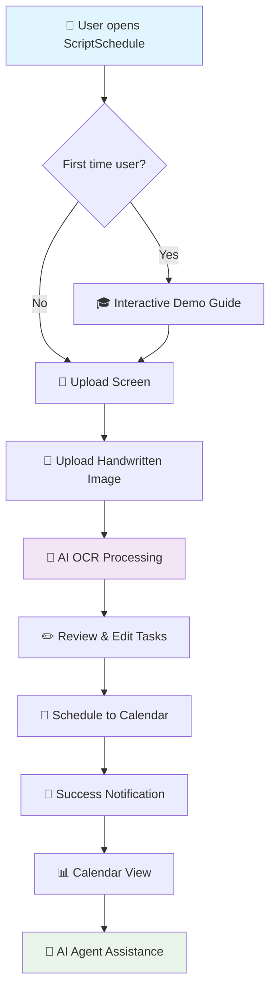

---

## 🏗️ System Architecture

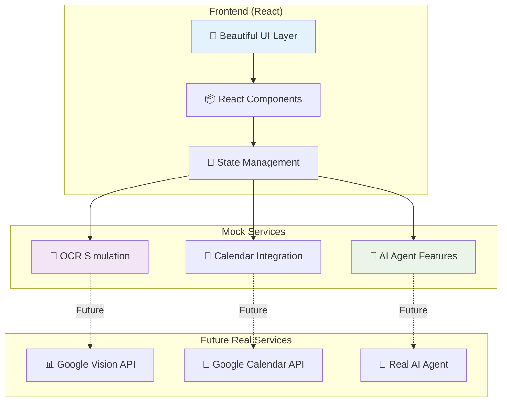

---

## 🎨 Design System

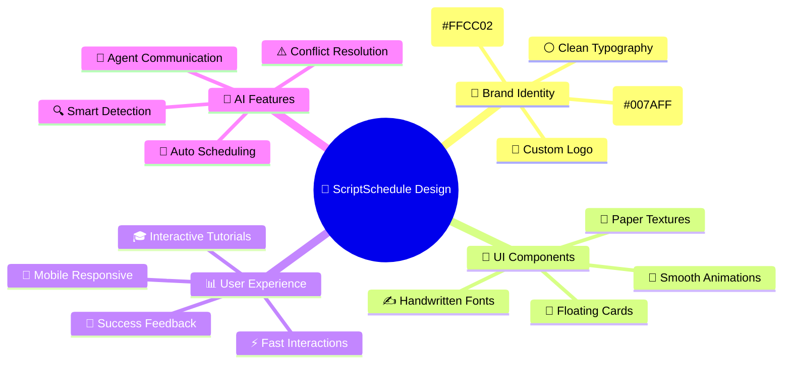

---

## 📊 Feature Breakdown

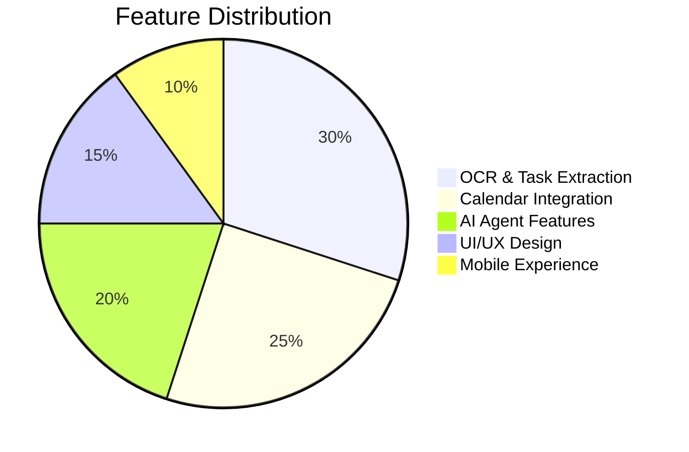

---

## 🔄 Data Flow

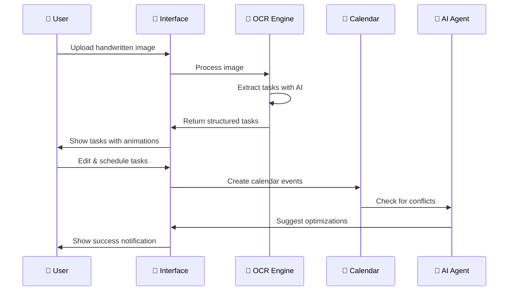

---

## 🚀 Technology Stack

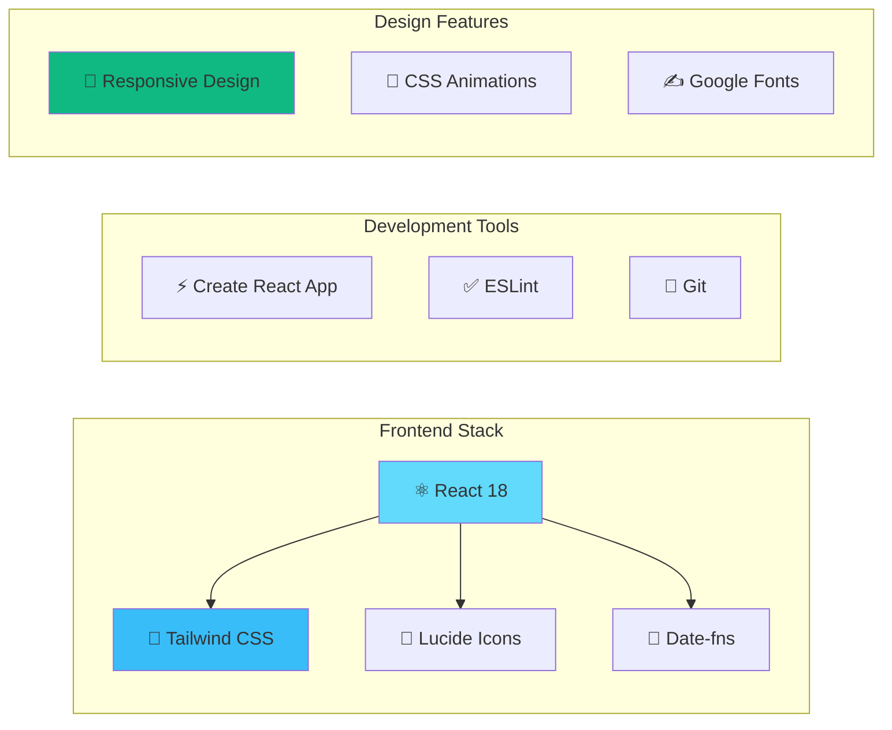

---

## 🎯 User Personas & Use Cases

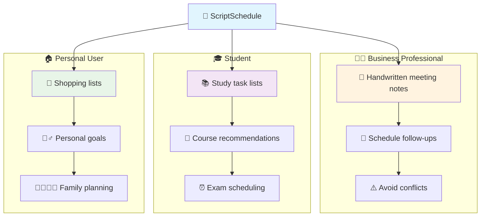

---

## 🤖 AI Agent Capabilities

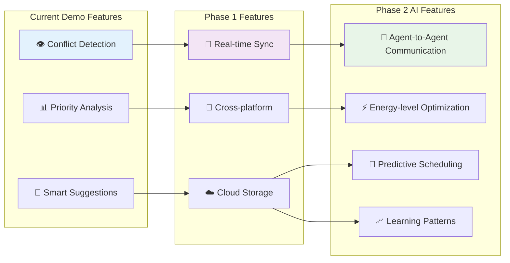

---

## 📱 Responsive Design Strategy

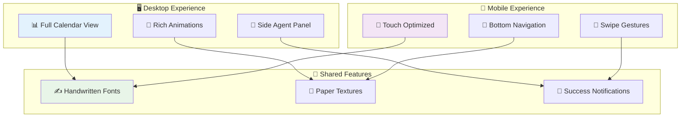

---

## 🎪 Demo Scenarios

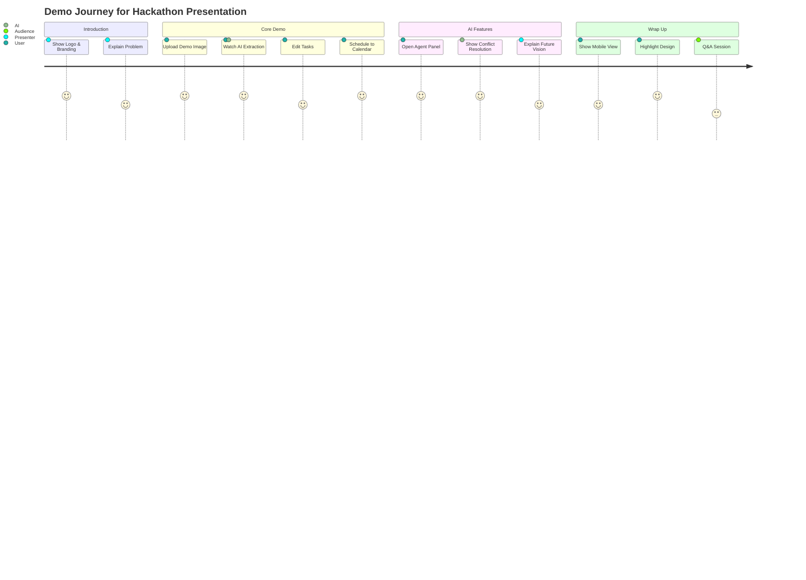

---

## 🎯 Success Metrics

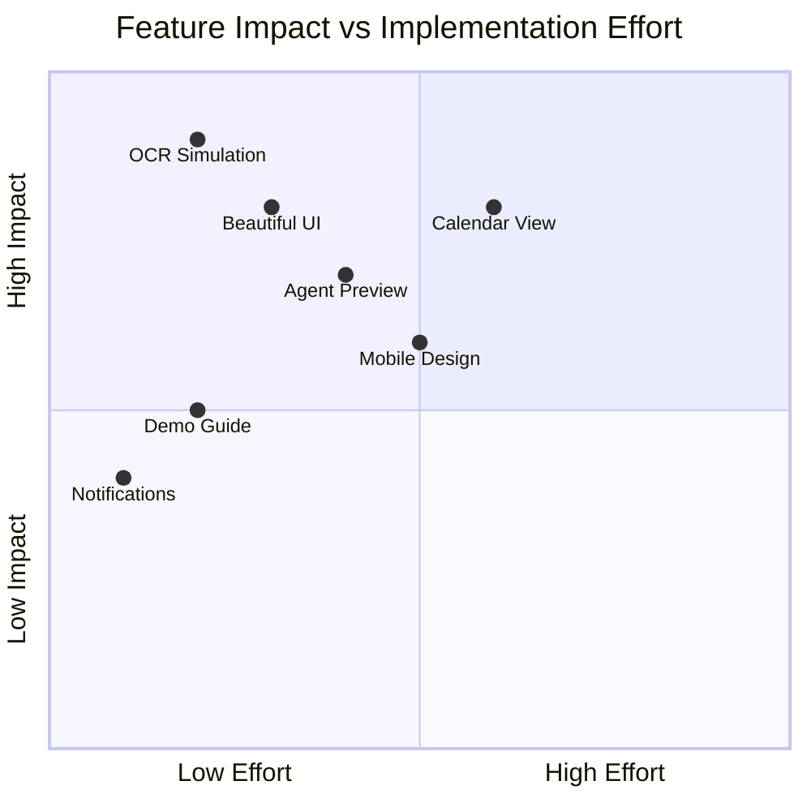

---

## 🚀 Future Roadmap

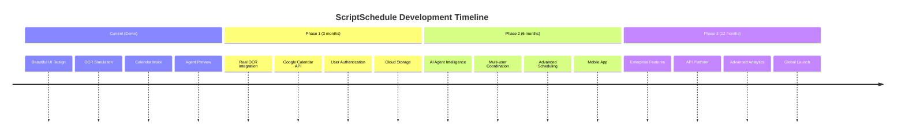

---

## 💡 Key Insights

### 🎯 **Product Strengths**
- **Visual Appeal**: Beautiful GoodNotes-inspired design
- **User Experience**: Intuitive flow with guided tutorials
- **Future Vision**: Clear AI agent roadmap
- **Technical Excellence**: Modern React architecture

### 🚀 **Competitive Advantages**
- **Handwritten Focus**: Unique OCR-to-calendar pipeline
- **AI Agent Preview**: Shows future automation potential
- **Design Quality**: Premium feel with attention to detail
- **Demo Ready**: Perfect for presentations and user testing

### 🎪 **Perfect for Hackathons**
- **Immediate Impact**: Users understand value instantly
- **Technical Depth**: Shows both frontend and AI capabilities
- **Scalable Vision**: Clear path to real-world implementation
- **Market Ready**: Addresses real user pain points

---

**🎉 ScriptSchedule: Where handwritten meets intelligent scheduling!** 